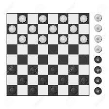

<!DOCTYPE html>
<html lang="en">
<head>
<meta charset="UTF-8">
<meta http-equiv="X-UA-Compatible" content="IE=edge">
<meta name="viewport" content="width=device-width, initial-scale=1.0">
<meta name="generator" content="Asciidoctor 2.0.8">
<meta name="author" content="Álvaro Martín">
<link rel="stylesheet" href="https://fonts.googleapis.com/css?family=Open+Sans:300,300italic,400,400italic,600,600italic%7CNoto+Serif:400,400italic,700,700italic%7CDroid+Sans+Mono:400,700">
<link rel="stylesheet" href="https://cdnjs.cloudflare.com/ajax/libs/font-awesome/4.7.0/css/font-awesome.min.css">
</head>
<body class="book">

<h1>Damas</h1>

Álvaro Martín 
<a href="mailto:amartinm82@gmail.com">amartinm82@gmail.com</a> 
version 1.0

Índice

<ul class="sectlevel1">
<li><a href="#modelo-del-dominio">Modelo del Dominio</a></li>
<li><a href="#requisitos">Requisitos</a></li>
<li><a href="#vista-de-casos-de-uso">Vista de Casos de Uso</a>
<ul class="sectlevel2">
<li><a href="#prototipo-de-interfaz">Prototipo de Interfaz</a></li>
</ul>
</li>
<li><a href="#instalacion">Instalación</a></li>
<li><a href="#uso">Uso</a></li>
<li><a href="#tests">Ejecutar tests</a></li>
<li><a href="#autor">Autor</a></li>
<li><a href="#nota-practica">Nota de la práctica</a></li>
</ul>

<h2 id="modelo-del-dominio">Modelo del Dominio</h2>

<table class="tableblock frame-none grid-none stretch">
<colgroup>
<col style="width: 70%;">
<col style="width: 30%;">
</colgroup>
<tbody>
<tr>
<td class="tableblock halign-left valign-top">

<ul>
<li>

Elementos: <strong>dos jugadores</strong>, un <strong>tablero de ajedrez</strong>, con una esquina blanca a la derecha de cada jugador, y <strong>fichas blancas y negras</strong>, para los dos jugadores, <strong>12 peones</strong> y <strong>2 damas</strong>

</li>
<li>

En el <strong>estado inicial</strong> de la partida se colocan todas los peones de cada jugador en los <strong>cuadros negros</strong> de las <strong>tres filas más cercanas</strong> a éste, como en la siguiente imagen.

</li>
<li>

Los <strong>jugadores mueven alternativamente</strong> una de sus fichas, <strong>empezando</strong> por el jugador de las fichas <strong>blancas</strong>, de una de las siguientes maneras:

<ul>
<li>

un <strong>peón de una casilla puede mover a una de las dos casillas adyacentes en diagonal y hacia adelante</strong>, si ésta está <strong>vacia</strong>

</li>
<li>

un <strong>peón de una casilla puede mover a una de las dos casillas adyacentes de las adyacentes en diagonal y hacia adelante</strong>, si ésta esta <strong>vacía</strong> y la adyacente está <strong>ocupada por un ficha contraria</strong> repitiendo este mismo movimiento hasta 3 veces desde la nueva casilla. Todas las fichas contrarias "<strong>saltadas</strong>" en este momvimiento se <strong>retiran del tablero</strong>

</li>
<li>

en cualquiera de los dos casos anteriores, si un <strong>peón termina su movimiento en la última fila del tablero</strong>, se convierte en <strong>dama</strong>.

</li>
<li>

una <strong>dama de una casilla puede mover a una de las casillas diagonales</strong>, si existe como <strong>máximo una ficha contraria</strong>, repitiendo este mismo movimiento hasta 3 veces desde la nueva casilla. Todas las fichas contrarias "<strong>saltadas</strong>" se <strong>retiran del tablero</strong>

</li>
</ul>

</li>
<li>

<strong>Pierde el jugador que no puede realizar movimientos</strong>, porque <strong>no se cumplen las condiciones</strong> para el movimiento de todas sus fichas o que ya <strong>no hay fichas</strong> sobre el tablero

</li>
</ul>

</td>
<td class="tableblock halign-left valign-top">
<table class="tableblock frame-none grid-none stretch">
<colgroup>
<col style="width: 100%;">
</colgroup>
<tbody>
<tr>
<td class="tableblock halign-left valign-top">

<ul>
<li>

<a href="https://en.wikipedia.org/wiki/Draughts"><strong>Wiki</strong></a>

</li>
<li>

<a href="https://www.youtube.com/watch?v=bN8VO8Nt0ws"><strong>Youtube</strong></a>

</li>
</ul>

</td>
</tr>
<tr>
<td class="tableblock halign-left valign-top">

</td>
</tr>
</tbody>
</table>
</td>
</tr>
</tbody>
</table>

<h2 id="requisitos">Requisitos</h2>

<table class="tableblock frame-all grid-all stretch">
<colgroup>
<col style="width: 50%;">
<col style="width: 50%;">
</colgroup>
<tbody>
<tr>
<td class="tableblock halign-left valign-top">

<ul>
<li>

<em>Funcionalidad: <strong>Básica</strong></em>

</li>
<li>

<em>Interfaz: <strong>Texto</strong></em>

</li>
<li>

<em>Distribución: <strong>Standalone</strong></em>

</li>
<li>

<em>Persistencia: <strong>No</strong></em>

</li>
</ul>

</td>
<td class="tableblock halign-left valign-top">

</td>
</tr>
</tbody>
</table>

<h2 id="vista-de-casos-de-uso">Vista de Casos de Uso</h2>

<table class="tableblock frame-all grid-all stretch">
<colgroup>
<col style="width: 50%;">
<col style="width: 50%;">
</colgroup>
<thead>
<tr>
<th class="tableblock halign-left valign-top">Diagrama de Actores y Casos de Uso</th>
<th class="tableblock halign-left valign-top">Diagrama de Contexto</th>
</tr>
</thead>
<tbody>
<tr>
<td class="tableblock halign-left valign-top">

</td>
<td class="tableblock halign-left valign-top">

</td>
</tr>
</tbody>
</table>

<h3 id="prototipo-de-interfaz">Prototipo de Interfaz</h3>
<table class="tableblock frame-none grid-nonen stretch">
<colgroup>
<col style="width: 50%;">
<col style="width: 50%;">
</colgroup>
<tbody>
<tr>
<td class="tableblock halign-left valign-top">

<strong>Arranque</strong>

</td>
<td class="tableblock halign-left valign-top">

<strong>Peón convertido en dama</strong>

</td>
</tr>
<tr>
<td class="tableblock halign-left valign-top" rowspan="3">

<pre>Las Damas!!!

 12345678
1 n n n n1
2n n n n 2
3 n n n n3
4        4
5        5
6b b b b 6
7 b b b b7
8b b b b 8
 12345678
Mueven las blancas: 61.52

 12345678
1 n n n n1
2n n n n 2
3 n n n n3
4        4
5 b      5
6  b b b 6
7 b b b b7
8b b b b 8
 12345678
Mueven las negras: 32,43

 12345678
1 n n n n1
2n n n n 2
3   n n n3
4  n     4
5 b      5
6  b b b 6
7 b b b b7
8b b b b 8
 12345678
 Mueven las ...</pre>

</td>
<td class="tableblock halign-left valign-top">

<pre>                    ...

 12345678
1        1
2        2
3 n      3
4n b     4
5        5
6        6
7 b      7
8        8
 12345678
Mueven las negras: 72,83

 12345678
1        1
2        2
3 n      3
4n b     4
5        5
6        6
7        7
8  B     8
 12345678
 Mueven las ...</pre>

</td>
</tr>
<tr>
<td class="tableblock halign-left valign-top">

<strong>Posibles errores</strong>

</td>
</tr>
<tr>
<td class="tableblock halign-left valign-top">

<pre>Error!!! No te entiendo: &lt;d&gt;&lt;d&gt;{,&lt;d&gt;&lt;d&gt;}[0-2]
Error!!! No es una coordenada del tablero
Error!!! No hay ficha que mover
Error!!! No es una de tus fichas
Error!!! No vas en diagonal
Error!!! No está vacío el destino
Error!!! No comes contrarias
Error!!! No se puede comer tantas en un movimiento
Error!!! No avanzas
Error!!! No respetas la distancia
Error!!! No se puede comer tantas en un salto</pre>

</td>
</tr>
<tr>
<td class="tableblock halign-left valign-top">

<strong>Pierden las negras por bloqueo y continuan jugando</strong>

</td>
<td class="tableblock halign-left valign-top">

<strong>Pierden las blancas sin fichas y no continuan jugando</strong>

</td>
</tr>
<tr>
<td class="tableblock halign-left valign-top">

<pre> 12345678
1        1
2        2
3        3
4        4
5        5
6        6
7 n      7
8b       8
 12345678
Derrota!!! No puedes mover tus fichas!!!
¿Queréis jugar otra? (s/n): s

Las Damas!!!

 12345678
1 n n n n1
2n n n n 2
3 n n n n3
4        4
5        5
6b b b b 6
7 b b b b7
8b b b b 8
 12345678</pre>

</td>
<td class="tableblock halign-left valign-top">

<pre> 12345678
1        1
2        2
3        3
4        4
5        5
6  n n   6
7 n      7
8  N     8
 12345678
Derrota!!! No puedes mover tus fichas!!!
¿Queréis jugar otra? (s/n): s</pre>

</td>
</tr>
</tbody>
</table>

<h2 id="instalacion">Instalación</h2>

<pre>mvn install</pre>

<h2 id="uso">Uso</h2>

<table class="tableblock frame-none grid-nonen stretch">
<colgroup>
<col style="width: 50%;">
<col style="width: 50%;">
</colgroup>
<tbody>
<tr>
<td class="tableblock halign-left valign-top" rowspan="3">

<pre>mvn package java -jar target/draughts-1.0-SNAPSHOT.jar</pre>

</td>
</tr>
</tbody>
</table>

<h2 id="tests">Ejecutar tests</h2>

<pre>mvn test</pre>

<h2 id="autor">Autor</h2>

👤 <strong>Álvaro Martín Martín</strong>

* Github: [@amartinm82](https://github.com/amartinm82)

<h2 id="nota-practica">Nota de la práctica</h2>

👤 **Álvaro Martín Martín**

* grade: 9
* hours: 12

👤 **Luis Fernández**

* grade: 9

Note that you should have to [install JDK 8](http://www.oracle.com/technetwork/java/javase/downloads/jdk8-downloads-2133151.html) and [Maven](https://maven.apache.org/install.html) as prerequisite.

Version 1.0 
Last updated 2019-11-15 17:05:00 +0100

</html>

